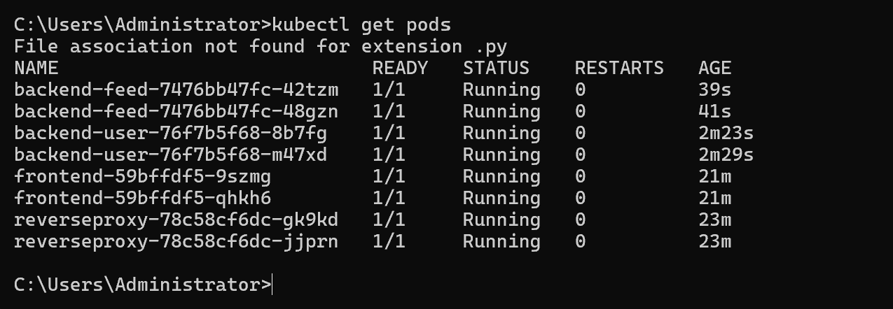
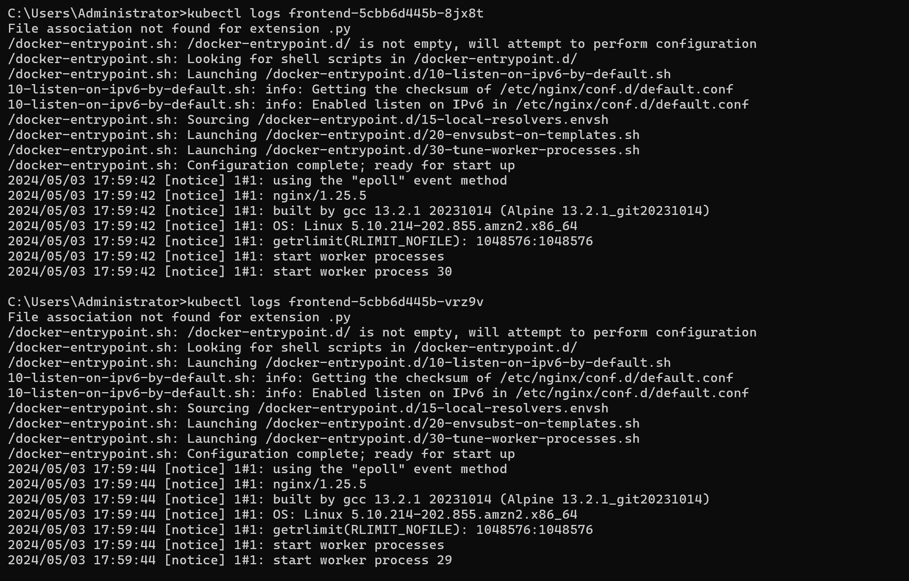

# Screenshots
To help review your infrastructure, please include the following screenshots in this directory::

## Deployment Pipeline
* DockerHub showing containers that you have pushed


* GitHub repository’s settings showing your Travis webhook (can be found in Settings - Webhook)

* Travis CI showing a successful build and deploy job


## Kubernetes
* To verify Kubernetes pods are deployed properly
```bash
kubectl get pods
```

* To verify Kubernetes services are properly set up
```bash
kubectl describe services
```

* To verify that you have horizontal scaling set against CPU usage
```bash
kubectl describe hpa
```

* To verify that you have set up logging with a backend application
```bash
kubectl logs {pod_name}
```


